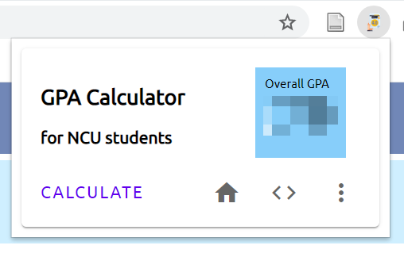

# Browser Extension for NCU GPA Calculator

## Overview
GPA is an essential part for applying to foregin grad school. Although it is not very hard to calculate, but I personally don't like to do that. So, I developed this extension for every people just like me. See the UI down below.
> 簡單來說，就是很懶不想自己算! One click GPA.



### How to use it?
1. Go to [NCU portal](https://portal-preview.cc.ncu.edu.tw/login) and login.

2. And go to **Score** or **成績查詢**, once the page is loaded, click the extension on your top right.

3. Finally click **CALCULATE** button, and your GPA score will show up in the light blue square.

## Setup
You can either directly clone this project or fork it to yours.
```
git clone https://github.com/h164654156465/ncu-gpa-calculator.git
npm install
```

## Development
First build your project
```
npm run build
```
After building, you'll see **dist** foldler generated.

1. Navigate to your [chrome extension page](chrome://extensions/), toggle **Developer mode** on your top right.

2. Next, click **Load unpacked** button, choose **dist** foler, and it will be loaded as an extension.

Every time you have new changes to the source codes, please rebuild your entire project and follow the steps specified above.

## Reference
[NCU GPA formula](http://pdc.adm.ncu.edu.tw/Form/form/form00-07t.pdf)

## Contact
Feel free to contact me if you have any one of these situations.
- suggest a new feature
- find some bugs
- develop this project with me

My email: h164654156465@outlook.com

## License
[Apache 2.0 license](LICENSE)